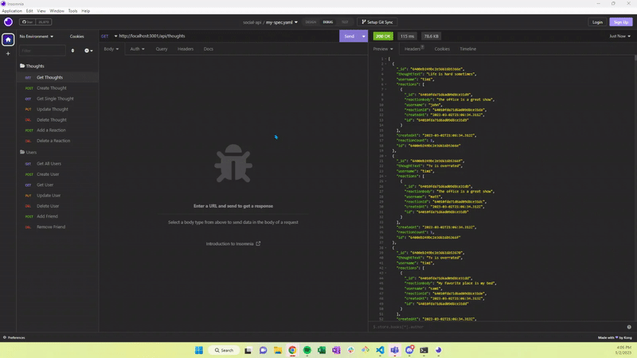

# social-api

## Description

This social networking backend was created for a user to be able to post thoughts, manage friends, and create reactions to other thoughts. The application utilizes Express, Mongoose, and MongoDB. 

## Installation

You can access the social networking backend by cloning the repo and running `npm start`. 

## Usage

Below is a screen recording of the completed e-commerce backend and its functionality. For the full screen recording [go here](https://drive.google.com/file/d/18VV2jGEawxKU9fkcAVC2Q7IqWbHJsH6O/view).

## Credits

Thanks to [w3schools](https://w3schools.com) and [MDN Web Docs](https://developer.mozilla.org/en-US/) for JavaScript tutorials. [ezgif](https://ezgif.com) was used to convert the screen recording into a gif. Also thank you to [Mongoose Documentation](https://mongoosejs.com/docs/6.x/docs/guide.html).

## License

Please refer to the LICENSE in the repo.
